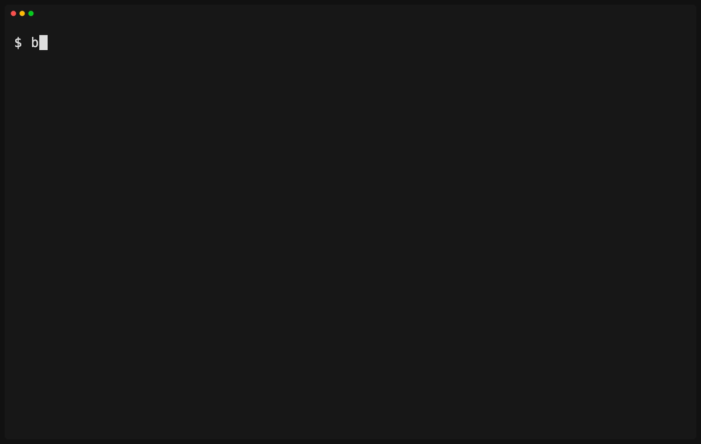

# Backlot

Private project memory for public repos and coding agents.

Backlot gives each project repo a local `.backlot/` directory for private
handoffs, roadmap notes, drafts, prompts, and local scripts without putting
that material in the project repo's Git history.

One private archive. Many projects. No nested Git repo sprawl.

- Keep agent handoffs and roadmap notes beside the code.
- Let agents read private context without committing it.
- Keep public `git status` clean.

## Contents

- [Why Backlot?](#why-backlot)
- [Install](#install)
- [Quickstart](#quickstart)
- [Syncing Across Machines](#syncing-across-machines)
- [Automatic Sync On macOS](#automatic-sync-on-macos)
- [How It Works](#how-it-works)
- [Directory Layout](#directory-layout)
- [Using Backlot With LLMs And Agents](#using-backlot-with-llms-and-agents)
- [Commands](#commands)
- [Safety Model](#safety-model)
- [Cleanup](#cleanup)
- [Limitations](#limitations)
- [FAQ](#faq)

## Why Backlot?

Project context tends to collect beside the code: notes, LLM memory, prompts,
roadmap drafts, local scripts, experiments, and half-formed thoughts. That
context is useful precisely because it lives near the work, but it should not
end up in the repo's history by accident.

Backlot keeps that private workspace close to the project while storing it in a
separate Git repo you control. It works for open source repos, private company
repos, and anything that might become public later.

## Install

Homebrew:

```sh
brew install massivemoose/tap/backlot
```

Manual download:

1. Download the archive for your OS and architecture from the
   [GitHub Releases page](https://github.com/massivemoose/backlot/releases).
2. Verify it against `checksums.txt`:

   ```sh
   shasum -a 256 -c checksums.txt
   ```

3. Place the `backlot` binary somewhere on your `PATH`.

Install into your Go binary path:

```sh
go install github.com/massivemoose/backlot@latest
```

Build from source:

```sh
go build -o backlot .
```

## Quickstart



Start from an existing project repo that has an `origin` remote:

```sh
backlot init
cd ~/code/my-project
git remote get-url origin
backlot attach
backlot agents setup
```

Your private workspace now lives at `.backlot/` inside the project repo and is
stored under `~/.backlot`. Backlot uses your project repo's `origin` URL to
choose a stable archive path such as `github.com/you/my-project`.
`backlot agents setup` previews Codex and Claude sandbox config. Add
`--tool codex --apply` or `--tool claude --apply` when you want Backlot to
write supported persistent config; see [Using Backlot With Coding
Agents](docs/agents.md).

To back it up or use it across machines, create an empty private repo named
`backlot-archive` on GitHub or your Git host. Do not initialize that repo with a
README, license, or `.gitignore`. Then add it as the archive remote:

```sh
backlot init --remote git@github.com:you/backlot-archive.git
backlot sync -m "Initial Backlot archive"
```

Use `init --remote` for first-machine setup. If you want to work on another
machine, clone the existing archive and attach your project repo again:

```sh
backlot clone git@github.com:you/backlot-archive.git
cd ~/code/my-project
backlot attach
```

For normal setup, you should not need to modify `~/.backlot` directly.

## Syncing Across Machines

`backlot sync` is a two-way Git sync for the private archive. It commits local
private changes, fetches remote archive changes, rebases local commits when
needed, and pushes the result.

Run it before switching machines and after starting work on another machine:

```sh
backlot sync
```

If two machines edit the same private file, Git may report a conflict. Backlot
will stop and point at the conflicted files through your project link, such as
`.backlot/notes.md`. Resolve the conflict in `.backlot/`, then run:

```sh
backlot sync --continue
```

To abandon the interrupted sync and return the archive to its previous state,
run:

```sh
backlot sync --abort
```

Conflict resolution is manual for now so Backlot does not guess which private
notes to keep.

## Local Archive Encryption

Backlot can encrypt the archive Git blobs while keeping your `.backlot/`
worktree plaintext for you and your tools:

```sh
backlot lock
```

`lock` writes archive metadata, configures local Git filters, stages the archive
for renormalization, and prints a recovery key once. Store that key somewhere
safe. It is base64url-encoded key material; if you lose it and the local key
store is gone, Backlot cannot recover encrypted archive data.

After locking, run:

```sh
backlot sync
```

On another machine, clone the archive and unlock it with the saved key:

```sh
backlot clone git@github.com:you/backlot-archive.git
backlot unlock --recovery-key-file ~/backlot-recovery.key
```

v0 encryption is local and self-managed. The local key is stored under the
archive Git directory with `0600` permissions. Backlot does not use hosted
recovery, macOS Keychain, Secret Service, or BIP-39 recovery phrases.

Encryption does not hide Git metadata. Remotes, filenames, tree shape, commit
history, commit messages, timestamps, and approximate object sizes remain
visible. Locking also does not rewrite old history; archive commits made before
`backlot lock` may still contain plaintext.

To return future syncs to plaintext, run:

```sh
backlot encryption disable
backlot sync -m "Disable Backlot archive encryption"
```

This does not rewrite old encrypted history.

## Automatic Sync On macOS And Linux

Auto-sync is opt-in background sync for macOS and Linux. macOS uses a
Backlot-owned LaunchAgent, and Linux uses a `systemd --user` timer/service
pair. Enable it with a Go-style duration:

```sh
backlot autosync enable --interval 15m
backlot autosync status
```

The first run starts immediately. Later runs skip intervals while the machine
is asleep or a previous run is still active. Archives without an `origin` are
allowed, but auto-sync can only create local commits until a remote is added.

An unattended conflict is handled differently from an interactive
`backlot sync`: Backlot records the conflict, aborts the rebase to leave the
archive clean, pauses future automatic runs, and sends one best-effort macOS
or Linux desktop notification when available. Run:

```sh
backlot sync
```

If the conflict recurs, resolve the files and finish with
`backlot sync --continue`, or abandon it with `backlot sync --abort`. A
successful manual sync clears the pause and automatic runs resume.

Other failures retry at the next interval. Backlot sends one notification
after three consecutive failures of the same kind. Because notifications may
be denied or missed, `backlot autosync status`, `backlot status`, and
`backlot doctor` remain the authoritative ways to check recovery state.

Disable the managed scheduler files and remove runtime records with:

```sh
backlot autosync disable
```

## How It Works

Backlot creates a `.backlot` symlink in the repo you are working in:

```txt
~/code/my-project/.backlot -> ~/.backlot/github.com/you/my-project
```

The target lives inside one central private archive, defaulting to `~/.backlot`.
Backlot adds local ignore entries for `.backlot` to `.git/info/exclude`, so the
project repo ignores the private workspace without changing tracked files.

The archive path is based on the repo's `origin` remote. For example:

```txt
git@github.com:you/my-project.git
=> github.com/you/my-project
```

## Directory Layout

The first time Backlot creates a private workspace for a project, it looks like
this:

```txt
~/code/my-project/
  README.md
  src/
  .backlot -> ~/.backlot/github.com/you/my-project

~/.backlot/
  github.com/you/my-project/
    handoff.md
    state.md
    roadmap.md
    files.md
    plans/
```

These are starter defaults only. Rename them, delete them, or add your own
structure. Backlot does not enforce a layout inside a project's private
workspace, and later `backlot attach` runs will not recreate starter files you
removed.

### Custom Starters

Create your own `~/.backlot/.starter/` to customize new project workspaces:

```txt
~/.backlot/
  .starter/
    handoff.md
    roadmap.md
    prompts.md
    scripts/
```

When Backlot creates a project private folder for the first time, it copies the
contents of `.starter/` into that folder. The copy is literal: no variables, no
template rendering, and no automatic re-application. If `.starter/` exists but
is empty, new project folders start with only Backlot's `.backlot-project`
metadata marker.

To add new starter paths to project workspaces that already exist, run:

```sh
backlot starter apply
```

This applies the current `.starter/` to marked project workspaces in the local
Backlot archive. It only creates missing files and directories. Existing paths
are never overwritten, deleted, chmodded, or re-rendered. Use
`backlot starter apply --dry-run` to preview the additions.

`.backlot-project` is Backlot-owned metadata used to find project workspaces.
Do not put it in `.starter/`; `backlot attach` manages it automatically.

## Using Backlot With LLMs And Agents

Backlot is useful as a local memory space for coding agents. Add something like
this to `AGENTS.md`, `CLAUDE.md`, or your tool's project instructions:

```md
Use `.backlot/` for private project context, notes, drafts, prompts, and agent state.
Read `.backlot/handoff.md` and `.backlot/state.md` when starting work.
Do not copy private `.backlot/` content into commits, PRs, issues, or public docs unless explicitly asked.
```

One simple layout:

```txt
.backlot/
  handoff.md
  state.md
  roadmap.md
  files.md
  plans/
```

The structure is yours. Backlot only provides the private place to keep it.

### Agent Sandboxes

Backlot uses a `.backlot` symlink that points into your private Backlot archive,
usually under `~/.backlot`. Some coding agents enforce filesystem permissions
on the resolved symlink target, so `AGENTS.md` or `CLAUDE.md` can tell the
agent to use `.backlot/` but cannot grant access by itself.

If an agent asks for permission when reading or editing `.backlot/`, configure
that agent to trust your Backlot archive root. See [Using Backlot With Coding
Agents](docs/agents.md), or run:

```sh
backlot agents setup
```

## Commands

```sh
backlot help
backlot agents setup [--root PATH] [--tool codex|claude] [--apply]
backlot init [--root PATH] [--remote URL]
backlot clone <archive-url> [--root PATH]
backlot attach [--root PATH]
backlot detach [--root PATH]
backlot starter apply [--root PATH] [--dry-run]
backlot status [--root PATH]
backlot lock [--root PATH]
backlot unlock [--root PATH] [--recovery-key-file PATH]
backlot encryption disable [--root PATH]
backlot sync [--root PATH] [-m MESSAGE] [--quiet]
backlot sync [--root PATH] --continue
backlot sync [--root PATH] --abort
backlot autosync enable [--root PATH] [--interval DURATION]
backlot autosync disable [--root PATH]
backlot autosync status [--root PATH]
backlot protect
backlot doctor [--root PATH]
backlot version
```

- `help` shows this help.
- `agents setup` previews or applies coding-agent sandbox configuration.
- `init` creates or configures the local Backlot archive.
- `clone` clones an existing Backlot archive on a new machine.
- `attach` creates `.backlot` for the current repo.
- `detach` removes the current repo's Backlot symlink and local exclude entries.
- `starter apply` adds missing custom starter paths to marked project workspaces.
- `status` shows the current repo's Backlot state.
- `lock` enables local archive encryption and prints the recovery key once.
- `unlock` restores local key access and plaintext worktrees for encrypted archives.
- `encryption disable` stages the archive to sync plaintext contents going forward.
- `sync` pulls, commits, rebases, and pushes the private archive; `--continue`
  and `--abort` recover interrupted rebase conflicts, while `--quiet`
  suppresses normal success output.
- `autosync` manages opt-in macOS LaunchAgent or Linux systemd user timer
  automation and reports durable failure and conflict recovery state.
- `protect` installs a local pre-commit guard for `.backlot`.
- `doctor` diagnoses setup issues.
- `version` prints build metadata.

Backlot root resolution order:

1. `--root`
2. `BACKLOT_ROOT`
3. `~/.backlot`

## Safety Model

- Backlot writes local ignore rules to `.git/info/exclude`, not `.gitignore`.
- Backlot does not commit to your project repo.
- Backlot does not stage files in your project repo.
- Backlot does not push from your project repo.
- Backlot only syncs private archive contents when you run `backlot sync` or
  explicitly enable `backlot autosync`.
- `backlot lock` encrypts archive Git blobs. Worktrees stay plaintext.

For vulnerability reporting, see [SECURITY.md](SECURITY.md). For a plain
threat model, see [docs/security.md](docs/security.md).

### Why not `.gitignore`?

`.gitignore` is usually tracked. Writing to it would mutate the project repo and
could leak Backlot-specific setup into shared history.

`.git/info/exclude` is local to your clone. Backlot uses it so `.backlot` stays
ignored on your machine without changing files that belong to the project.

### Privacy

Private files stay local until you run `backlot sync`. When you sync, Backlot
commits and pushes the contents of your Backlot archive to the `origin` remote
configured for that archive. Use a private remote for anything sensitive.

If archive encryption is enabled, pushed private file contents are encrypted
Git blobs, but Git metadata remains visible. Keep the recovery key private and
backed up. See [docs/security.md](docs/security.md) for what encryption does
and does not protect.

## Cleanup

To disconnect Backlot from a repo, run:

```sh
backlot detach
```

This removes the managed `.backlot` symlink from the current repo and removes
Backlot's local exclude entries from `.git/info/exclude`. It does not delete
your private archive or any project notes.

If auto-sync is enabled, disable it before removing the archive:

```sh
backlot autosync disable
```

If you intentionally want to remove the entire private archive from your
machine, delete `~/.backlot` yourself after detaching the repos you care about.
Deleting `~/.backlot` does not automatically clean up `.backlot` symlinks in
attached repos; those links become broken until you remove them.

## Limitations

- macOS and Linux are supported.
- Automatic sync supports macOS LaunchAgent and Linux systemd user timers.
- Windows is not currently supported.
- Encryption v0 does not rewrite pre-lock history or provide hosted recovery.
- No daemon.
- No hosted sync.
- Requires Git.
- Requires a Git remote `origin` for project repos in the MVP.

## FAQ

### Can I use Backlot with private repos?

Yes. Backlot is useful for any repo where you want private notes or agent state
beside the code without putting that context in the repo's history.

### Does Backlot commit to my project repo?

No. Backlot never runs `git add`, `git commit`, or `git push` in your project
repo. `backlot sync` runs Git commands inside the Backlot archive.

### What if `.backlot` already exists?

Backlot refuses to overwrite a `.backlot` file, directory, or symlink it does
not manage. Move the existing path before running `backlot attach`.

### Can I use multiple Backlot archives?

Yes. Use `--root PATH` for one command or set `BACKLOT_ROOT` for a shell session.

### Can I choose my own structure inside `.backlot`?

Yes. Backlot creates a few starter files only when it creates a project
workspace for the first time, but it does not enforce their layout.
